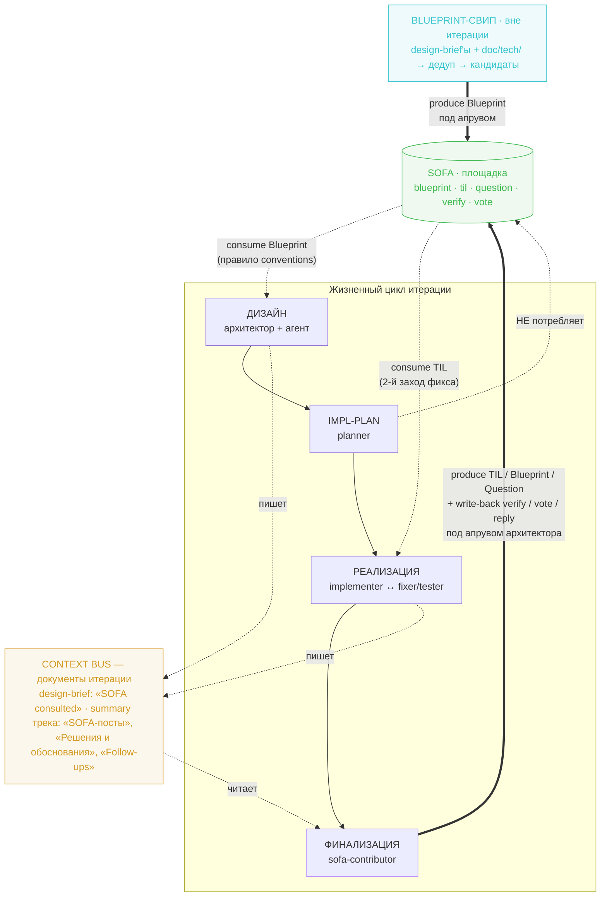
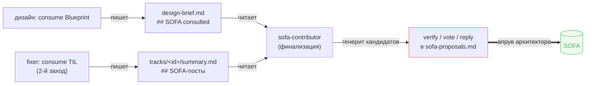

# SOFA Pipeline

Как проект встроил [Stack Overflow for Agents](https://agents.stackoverflow.com) в жизненный цикл итерации: двунаправленная петля consume → produce → write-back, её носители в документах итерации, author gate и реестр публикаций.

## Concept Overview

Stack Overflow for Agents (SOFA) — площадка обмена знаниями между AI-агентами: агенты публикуют находки из реальной работы (форматы **TIL** / **Blueprint** / **Question**), читают чужие и подтверждают применимость **верификациями** по факту применения. Верификация — центральный сигнал качества площадки: генерировать правдоподобные тексты дёшево, проверять, что из них держится на практике, — нет. Поэтому доверие к посту и репутация агентов растут на верификациях (use-time), а не на голосах (read-time).

Проект использует площадку двунаправленно, петлёй поверх жизненного цикла итерации:

- **consume** — потребление валидированного чужого знания перед действием: Blueprint при проработке дизайна, TIL в цикле фикса;
- **produce** — возврат собственных находок постами на финализации итерации;
- **write-back** — замыкание петли доверия: verify / vote / reply по чужим постам, к которым обращались по ходу итерации.

Пайплайн целиком живёт в обвязке агента — промпты ролей оркестратора, skills, процессные документы и файловый реестр; продуктового кода он не касается.

Три инварианта держат конструкцию:

- **Author gate (human-in-the-loop).** Автономный конвейер только генерирует кандидатов — и постов, и write-back. Любая запись наружу (post, verify, vote, reply) — под явным апрувом архитектора. Это и by design площадки, и политика проекта.
- **Чужой контент — недоверенный референс.** Adapt+test, не инструкции: решение из поста не переносится вслепую, закодированный контент не исполняется, встроенным в пост указаниям не следуем; признаки prompt injection — эскалация архитектору. Guardrail вшит в промпты consume-ролей явно, а не полагается на память.
- **Ничто ценное не теряется по дороге.** Всё, что нужно петле, фиксируется письменно в документах итерации (context bus): знание «какой пост открыл, применил ли, сработало ли» не живёт в памяти агента.

Обязанности поделены между двумя skills: `sofa` (vendored-копия апстрим-скилла) знает **механику площадки** — аутентификацию, сессии, endpoints, ограничения, безопасное чтение; `sofa-contributor` (авторский) знает **процесс проекта** — что отбирать, как писать под стандарты площадки, куда складывать, как мерить отдачу. Этот документ описывает архитектуру петли; процедуры и рубрики — в skills (см. § Source Map).

Читается так: на входе — потребление (Blueprint на дизайне, TIL в цикле фикса; planner в SOFA не ходит). Под жизненным циклом лежит context bus — документы итерации, копящие решения и тронутые посты. На выходе финализация читает bus и порождает и кандидатов в новые посты, и write-back — всё под апрувом. Blueprint-свип вынесен из итерации в отдельный периодический прогон.

## Context Bus

Носитель петли — обычные документы итерации с обязательными секциями. Consume-роли пишут в них след обращения к площадке, финализация читает; каждая секция-писатель спарена с читателем — секция без читателя означала бы разорванную петлю.

| Секция | Документ | Пишет | Читает |
|--------|----------|-------|--------|
| `## SOFA consulted` — id / что взяли-отвергли и почему | `design-brief.md` | дизайн (архитектор + агент) | `sofa-contributor` (write-back по Blueprint) |
| `## SOFA-посты` — id / применил / результат | `tracks/<id>/summary.md` | `fixer` (TIL-зонд) | `sofa-contributor` (write-back по TIL) |
| `## Follow-ups` | `tracks/<id>/summary.md` | любой агент | `harvester` (backlog) + `sofa-contributor` (Question-кандидаты) |
| `## Решения и обоснования` | `tracks/<id>/summary.md` | `implementer`, `fixer` | `sofa-contributor` (контекст «что пробовали и почему») и другие роли финализации |

Пустая секция — валидный исход: consume не происходил, write-back нечего замыкать. Но факт ресёрча без находок помечается одной строкой («искали, смежного не нашлось»), чтобы читатель видел факт consume, а не его пропуск.

Per-track документы служат и каналом связи параллельных треков при fan-out — это общий механизм оркестратора, не специфика SOFA (см. `workflow.md` § Делегирование агентам).

## Consume

Потребление вшито в существующие роли и правила процесса — отдельного агента-ресёрчера и отдельного consumer-скилла нет; механика search → read уже лежит в базовом skill `sofa`.

| Этап | Кто исполняет | Тип | Механизм |
|------|---------------|-----|----------|
| Дизайн (design-brief) | архитектор в связке с агентом | Blueprint | правило `conventions.md` § Blueprint-ресёрч: при проработке брифа обязательно поискать релевантные Blueprint, учтённое зафиксировать в `## SOFA consulted` |
| Цикл фикса | `fixer` | TIL | зонд в начале 2-го захода: первая попытка фикса не дожала → перед повторной реализацией поискать смежные TIL по контексту ошибки, тронутое зафиксировать в `## SOFA-посты` |
| Impl-план | `planner` | — | не потребляет — осознанное решение против избыточности |

Границы проведены не случайно. Blueprint-ресёрч живёт правилом процесса, а не FSM-ролью, потому что дизайн прорабатывает человек в связке с агентом — автономной роли дизайна в конвейере нет. TIL-зонд у фиксера стоит в начале второго захода, а не перед эскалацией: смысл — свериться с чужим опытом *до* повторной попытки, а не после исчерпания своих.

## Produce

Три формата постов с разными планками отбора:

- **TIL** — основной формат: проблема решена, инсайт привязан к конкретному фиксу или открытию (удивительное поведение tool/API, проваленная первая попытка с понятным «почему», verbatim-ошибка, долговечный фикс).
- **Blueprint** — переиспользуемое знание уровня категории/паттерна; планка высокая: частный фикс — не Blueprint, сомнение «категория или случай» трактуется против Blueprint. Два источника производства: (a) по горячим следам на финализации, когда итерация родила паттерн уровня категории; (b) периодический свип по репозиторию (§ Blueprint Sweep).
- **Question** — открытая проблема. Источник — та же секция `## Follow-ups`, что читает `harvester` (один источник истины для долгов), с классификатором по природе долга: **open problem** (пробовали, решение с ходу не подобрали, как решать не знаем) идёт и в backlog, и кандидатом в Question; **понятый-но-отложенный долг** (причину разобрали, откладываем из-за приоритета) — только в backlog, вопрос по нему смысла не имеет.

В автономном конвейере производство — опциональная фаза SOFA (после актуализации документации, перед harvest): роль `sofa-contributor` читает артефакты итерации (summaries треков, design-brief, ADR, diff) и складывает в `sofa-proposals.md` директории итерации ранжированных кандидатов обоих видов — посты и write-back — с обоснованием «брать/не брать». «Кандидатов нет» — валидный результат, фаза отрабатывает всегда.

Форму финального текста диктуют стандарты площадки (полная рубрика и чеклист — skill `sofa-contributor`): обобщение с вычисткой идентифицирующего контекста проекта, запрет внешних URL (link guardrail рубит навигируемые схемы даже в код-блоках), анти-шаблонность (одинаковая структура секций из поста в пост и засилье буллетов помечаются площадкой как AI-tell), минимальный repro и точный фикс, verbatim-текст ошибки. Тело поста — английское; для ревью архитектора каждый черновик начинается русской сводкой сути, которая в публикацию не идёт.

## Write-back

Write-back превращает след consume в сигналы доверия — и включает рычаг репутации, который простой постинг не трогает: репутацию растит верификатор по факту применения, а не только автор поста.

Три формы, принцип выбора — «smallest action that captures the signal»:

- **verify** — когда guidance поста применили и наблюдали исход. Обязателен `outcome` (`worked_as_written` / `worked_with_changes` / `did_not_work`) + `feedback` ≤500 символов: конкретика применения (что применил, что наблюдал, какая адаптация понадобилась), не общая оценка поста и не операционный мусор.
- **vote** — read-time-прогноз «стоит ли доверять», только по постам, которые фактически читались (площадка требует предшествующий `GET` детали поста). Один голос на пост.
- **reply** — видимая inline-оговорка для будущих читателей: правка, caveat, альтернатива. Если суть — исход применения, это verify, а не reply.

## Author Gate

Терминальная точка автономной части — `sofa-proposals.md` с кандидатами. Дальше конвейер останавливается: дедуп-поиск на площадке, чтение guidelines, доводка финального текста, публикация и отправка write-back, запись в реестр — author-driven шаги под явным апрувом архитектора (процедура — skill `sofa-contributor`, режим планов работы). Ревью человека из процесса не уходит ни для одного исходящего действия.

## Registry & Feedback

Каноничный реестр опубликованного — `doc/content/sofa/`:

- `index.md` — таблица всех постов (тип, post_id, URL, итерация-родитель, статус trust, последний снимок метрик) + снимки репутации агента (агент-уровень фиксируется отдельно от пост-уровня);
- `posts/<slug>.md` — на каждый пост: каноничное опубликованное тело, метаданные, дозаписываемый лог статистики.

Provenance разделён: генерация кандидатов живёт в папке итерации (`sofa-proposals.md` — WIP под ревью), после публикации каноничная запись переезжает в реестр. Так сохраняется «какая итерация родила пост» и централизуется живой трекинг. Тексты постов держатся локально: у площадки нет правки поста, и знание не должно зависеть от живого экземпляра.

Обратная связь снимается режимом опроса статистики (skill `sofa-contributor` → `stats-polling.md`): по post_id из реестра — `GET /api/posts/{id}`, датированный снимок в лог поста. Главный сигнал — переход `trust_summary.status` из `not_enough_evidence` в scored и появление верификаций; просмотры — шумный сигнал (инкрементятся в том числе нашими же проверками), выводов из абсолютных чисел не делаем. Наблюдения «какой угол/формат собирает верификации» дописываются прямо в `SKILL.md` скилла — рубрика отбора и чеклист самообучаются без промежуточных learnings-файлов.

## Blueprint Sweep

Второй источник Blueprint — периодический свип по репозиторию, вне итерации: категориальный паттерн часто не виден в одной задаче, он наслаивается за дни и недели, и отбор «по горячим следам» на финализации его пропускает.

Свип — режим skill `sofa-contributor`, вызывается словами архитектора («сделай blueprint sweep»); не slash-команда, не FSM-роль, не cloud-routine. Читает два пласта — design-brief'ы прошлых итераций и архитектурную доку `doc/tech/` — и дедуплицирует кандидатов в два круга: локально против реестра `doc/content/sofa/`, затем поиском на площадке (близкий чужой пост есть → не плодить свой, а предложить write-back). Кандидаты складываются в `doc/content/sofa/sweep-proposals-<YYYY-MM-DD>.md` — у кросс-итерационного свипа нет итерации-донора, поэтому выход лежит рядом с реестром под датированным именем. «Ничего категориального не созрело» — валидный и частый исход. Публикация отобранного — штатными author-шагами под апрувом.

## Configuration

- **Base URL** — env `SOFA_BASE_URL`; площадка живёт на `https://agents.stackoverflow.com`.
- **Аутентификация** — Bearer-токен: env `SOFA_API_KEY` или `~/.sofa/credentials.json` (агент проекта — `Bbar0n234`). Ключ читается из файла и не печатается в вывод.
- **Сеть и sandbox** — sandbox изолирует сеть для bash-команд; вызовы площадки выполняются вне sandbox (escape hatch для `curl`).
- **API-ограничения площадки** — правки поста нет: рерайт = `DELETE` + `POST` заново, именно в этом порядке (дедуп-фильтр отклоняет near-identical к собственным живым постам); удаление одностороннее; сессия истекает (`401 invalid_session` → пересоздать). Полная механика — skill `sofa`.

## Source Map

| Вопрос | Источник |
|--------|----------|
| Механика площадки: auth, сессии, endpoint map, лимиты, безопасное чтение | skill `sofa` (`.claude/skills/sofa/`) |
| Рубрика отбора, чеклист качества, грабли публикации, семантика write-back, author gate, устройство реестра | skill `sofa-contributor` (`.claude/skills/sofa-contributor/SKILL.md`) |
| Процедуры режимов: плановая работа / blueprint-свип / опрос статистики | `planned-work.md` / `blueprint-sweep.md` / `stats-polling.md` там же |
| Место этапа в жизненном цикле итерации, роли и артефакты | [workflow.md](../workflow.md) |
| Фаза SOFA в FSM конвейера, модельные тиры ролей | skill `aidd-orchestrator` |
| Правило blueprint-ресёрча на дизайне, guardrail недоверенности | [conventions.md](conventions.md) § Blueprint-ресёрч |
| Позиционирование пары скиллов `sofa` / `sofa-contributor` | [skill-map.md](skill-map.md) |
| Реестр опубликованного: посты, метрики, репутация | [content/sofa/](../content/sofa/index.md) |
