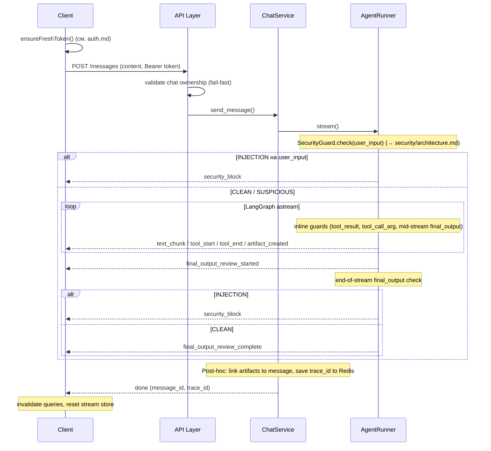
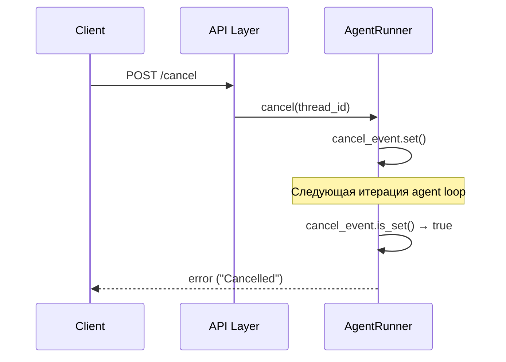

# SSE Streaming

Кросс-сервисный концепт: backend генерирует поток событий из LangGraph-графа, frontend потребляет через native fetch + ReadableStream. Транспорт — Server-Sent Events (SSE) поверх POST-запроса (не EventSource — нужен request body и Bearer header).

## Protocol Overview

Потоко-ориентированная модель: одно сообщение пользователя → один SSE-поток → terminal event (`done` | `error` | `security_block`). Wire format:

```
data: {"type": "text_chunk", "content": "Hello"}\n\n
data: {"type": "tool_start", "tool": "web_search", "call_id": "abc-123"}\n\n
data: {"type": "done", "message_id": "msg-uuid", "trace_id": "trace-uuid"}\n\n
```

Каждое событие — JSON-объект с обязательным полем `type` и type-specific payload. Разделитель — двойной перевод строки (`\n\n`).

## Event Types

| Type | Payload | Семантика |
|------|---------|-----------|
| `text_chunk` | `{content}` | Токен от LLM (прогрессивный вывод текста) |
| `tool_start` | `{tool, call_id}` | Агент инициировал вызов инструмента |
| `tool_end` | `{tool, call_id}` | Инструмент завершил выполнение |
| `artifact_created` | `{id, title, artifact_type}` | Агент создал артефакт (сохранён в БД) |
| `final_output_review_started` | `{}` | Перед end-of-stream проверкой final output |
| `final_output_review_complete` | `{}` | Final output проверен, verdict CLEAN |
| `trace_id` | `{trace_id}` | Langfuse trace ID (internal, не доходит до frontend) |
| `title_updated` | `{title}` | Сгенерированное auto-title название чата готово (non-terminal) |
| `done` | `{message_id, trace_id}` | Генерация завершена успешно |
| `error` | `{detail}` | Ошибка или отмена генерации |
| `security_block` | `{checkpoint, detection_layer}` | Блокировка по одному из четырёх runtime-checkpoint'ов |

`done`, `error` и `security_block` — взаимоисключающие **terminal events**. После любого из них поток закрывается. Если соединение обрывается без terminal event — frontend трактует это как connection lost.

`security_block` — отдельный от `error` event: security incidents отображаются специфичным UI (generic сообщение пользователю), не generic error. `checkpoint` принимает значения `user_input`, `tool_result`, `tool_call_arg`, `final_output`; `detection_layer` — `canary`, `unicode`, `fragment`, `paired`, `llm_classifier`. Подробнее — [architecture.md](../security/architecture.md).

`artifact_created` эмитится маппером по имени tool'а — срабатывает на любой artifact-producing tool (`create_artifact`, `generate_image`), форма события от tool'а не зависит; какие tools её порождают — [agent-runtime.md](agent-runtime.md#internal-tools).

`final_output_review_*` — non-terminal события вокруг end-of-stream проверки final output. Frontend показывает индикатор «проверка ответа» в паузе между последним `text_chunk` и `done`. При INJECTION на этой проверке вместо `final_output_review_complete` отправляется `security_block`.

`title_updated` — non-terminal, эмитится не чаще одного раза за стрим: `ChatService.send_message` запускает fire-and-forget генерацию auto-title чата (→ [backend.md § Layered Architecture](backend.md#layered-architecture)) на первом событии агента, не являющемся `security_block`, и между последующими событиями relay-цикла проверяет её готовность. Если генерация не успевает завершиться до терминального события — событие не отправляется, а title остаётся в БД до fallback-инвалидации (см. TanStack Query Invalidation ниже) или следующего штатного рефетча. После терминального события (`done`/`error`/`security_block`) `title_updated` не эмитится, даже если генерация к этому моменту завершилась.

`trace_id` — internal event: ChatService перехватывает его (не пробрасывает клиенту), сохраняет в Redis, а затем включает trace_id в payload `done` event. Frontend получает trace_id только через `done`.

## Stream Lifecycle



При ошибке на любом этапе — поток завершается событием `error` вместо `done`. При INJECTION на любом из четырёх runtime-checkpoint'ов — `security_block`.

## Cancellation

Двухуровневый механизм: graceful (основной) + hard (fallback).

### Graceful Cancel



- Backend: `asyncio.Event` per thread_id. `cancel()` устанавливает event, agent loop проверяет `is_set()` между итерациями графа.
- **Pending cancels:** если cancel приходит до старта стрима — сохраняется в `_pending_cancels`, применяется при следующем запуске.

### Hard Cancel

`AbortController.abort()` — разрывает fetch-соединение на стороне клиента. Используется при unmount компонента или если graceful cancel не сработал (сервер не ответил).

### Cancel vs Error на Frontend

Флаг `isCancellingRef` отличает user cancel от реальной ошибки. При cancel — error event приходит, но error toast не показывается.

## Backend: Event Generation

### AgentRunner

`LangGraphAgentRunner.stream()` — основной генератор событий:

1. Создаёт `asyncio.Event()` для cancellation, регистрирует thread_id
2. Вызывает `graph.astream(stream_mode=["messages", "updates"])`
3. **Messages stream:** фильтрует `AIMessageChunk` с string content → `text_chunk`
4. **Updates stream:** извлекает tool_calls и artifact metadata → `tool_start`, `tool_end`, `artifact_created`
5. Между итерациями проверяет `cancel_event.is_set()`
6. При исключении — yields `error` event, логирует

**Изоляция токенов субагента:** `run_subagent` — обычный tool с точки зрения `updates`-стрима (`tool_start`/`tool_end` эмитятся штатно), но внутри вызывает собственный скомпилированный `StateGraph` через `ainvoke` (→ [agent-runtime.md § Субагенты](agent-runtime.md#субагенты)). Чанки `stream_mode="messages"`, помеченные тегом `subagent` в metadata, отбрасываются **до** проверки `AIMessageChunk`, **до** накопления `full_response`/`last_message_id` и **до** canary/mid-stream проверок — токены субагента не рисуются в чат и не попадают в проверяемый final output. `cancel_event` при этом продолжает проверяться на каждой итерации, отмена остаётся отзывчивой и во время рана субагента.

### ChatService

`ChatService.send_message()` — relay + post-hoc обработка:

1. Валидирует thread ownership, коммитит обновление `updated_at` до входа в relay-цикл (эффект должен пережить весь стрим, а не только запрос — [conventions/db.md](conventions/db.md#db-сессии-и-commit))
2. Проксирует события от AgentRunner клиенту; на первом нетерминальном событии, если title чата ещё плейсхолдер, запускает fire-and-forget генерацию auto-title (→ [backend.md § Layered Architecture](backend.md#layered-architecture)) и между последующими событиями опрашивает её готовность, эмитя `title_updated`
3. **Post-hoc:** связывает артефакты с сообщением (`ArtifactRepository.set_message_id`)
4. Сохраняет trace_id в Redis (для feedback loop, подробнее — [observability](observability.md))
5. Emits terminal `done` event с message_id и trace_id

### API Layer

`_event_generator()` — маппинг `StreamEvent` → SSE wire format (`data: {json}\n\n`). Response headers:

| Header | Значение | Назначение |
|--------|----------|------------|
| Content-Type | text/event-stream | SSE MIME type |
| Cache-Control | no-cache | Запрет кэширования промежуточными прокси |
| X-Accel-Buffering | no | Отключение буферизации в Nginx |

Pre-validation: ownership чата проверяется до создания потока (fail-fast с HTTP 404, а не error event).

## Frontend: Stream Consumption

### useAgentStream Hook

Интерфейс: `{send(content), cancel()}`.

**send():**
1. `startStream(chatId)` — инициализация Zustand store
2. `ensureFreshToken()` — проактивный refresh токена (подробнее — [auth](auth.md))
3. `fetch()` с `AbortController` — POST с Bearer header
4. `response.body.getReader()` → чанковый парсинг с буфером неполных строк
5. Dispatch по `event.type` → обновление store / invalidation queries / callbacks
6. Reactive fallback: при 401 — повторный `ensureFreshToken()` + retry

**cancel():**
1. Устанавливает `isCancellingRef = true`
2. Вызывает `POST /cancel` через axios
3. При неудаче — `abortController.abort()` (hard fallback)

**Cleanup:** на unmount — abort signal + `endStream()`.

### Zustand Stream Store

Эфемерное состояние, существует только во время стрима:

| Поле | Тип | Назначение |
|------|-----|------------|
| `isStreaming` | boolean | Флаг активного стрима |
| `streamingText` | string | Накопленный текст (text_chunk) |
| `activeTool` | string \| null | Текущий выполняемый инструмент |
| `streamingArtifacts` | array | Артефакты, созданные в текущем стриме |
| `streamingChatId` | string \| null | ID чата текущего стрима |

Lifecycle: `startStream()` → accumulate (`appendText`, `setTool`, `addArtifact`) → `endStream()` (полный сброс).

Stream store — **не source of truth**. После `done` данные рефетчатся с сервера через TanStack Query. Store нужен только для real-time отображения во время генерации.

### TanStack Query Invalidation

SSE-события триггерят invalidation cached queries:

| Событие | Invalidated queries | Зачем |
|---------|-------------------|-------|
| `artifact_created` | `["projects", projectId, "artifacts"]` | Новый артефакт в списке |
| `title_updated` | — (`setQueryData`-патч, не инвалидация) | Точечно патчит поле `title` в трёх кэшах: `["projects", projectId, "chats"]` (список), `["chats", "recent"]`, `["projects", projectId, "chats", chatId]` (detail открытого чата). Инвалидация вместо патча зарефетчила бы detail мид-стрим и задвоила optimistic-копию user-сообщения в `localMessages` |
| `done` | `["projects", projectId, "chats", chatId]`, `["projects", projectId, "chats"]` (`exact: true`), `["chats", "recent"]` | Полное сообщение с сервера, обновление списков чатов; инвалидация списка проекта — fallback на случай, если `title_updated` не успел прийти до конца рана |

## API Endpoints

| Method | Path | Назначение | Auth |
|--------|------|-----------|------|
| POST | `/api/projects/{id}/chats/{cid}/messages` | Отправить сообщение, получить SSE-поток | Bearer |
| POST | `/api/projects/{id}/chats/{cid}/cancel` | Отменить генерацию | Bearer |
