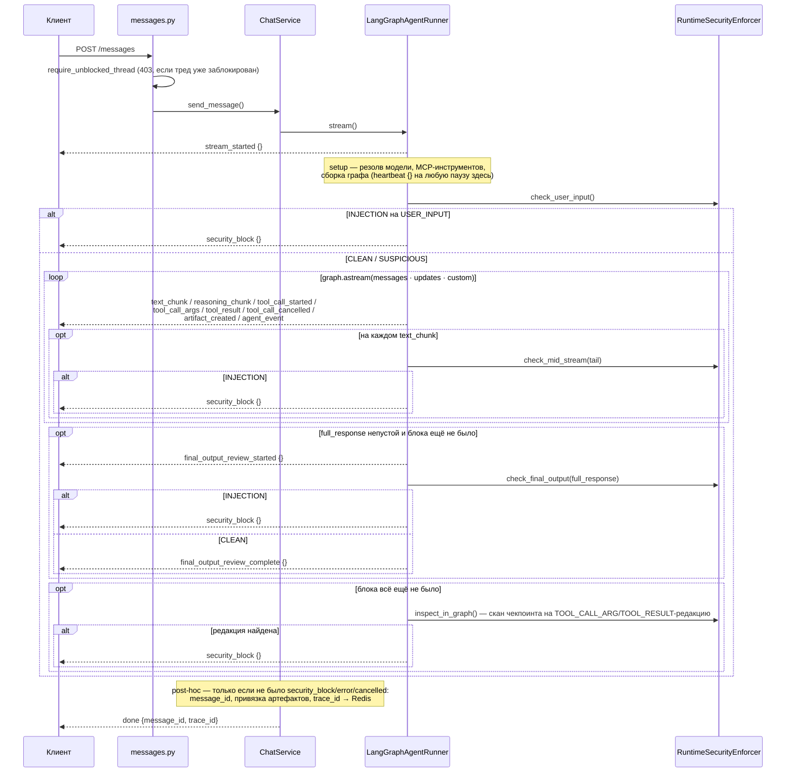
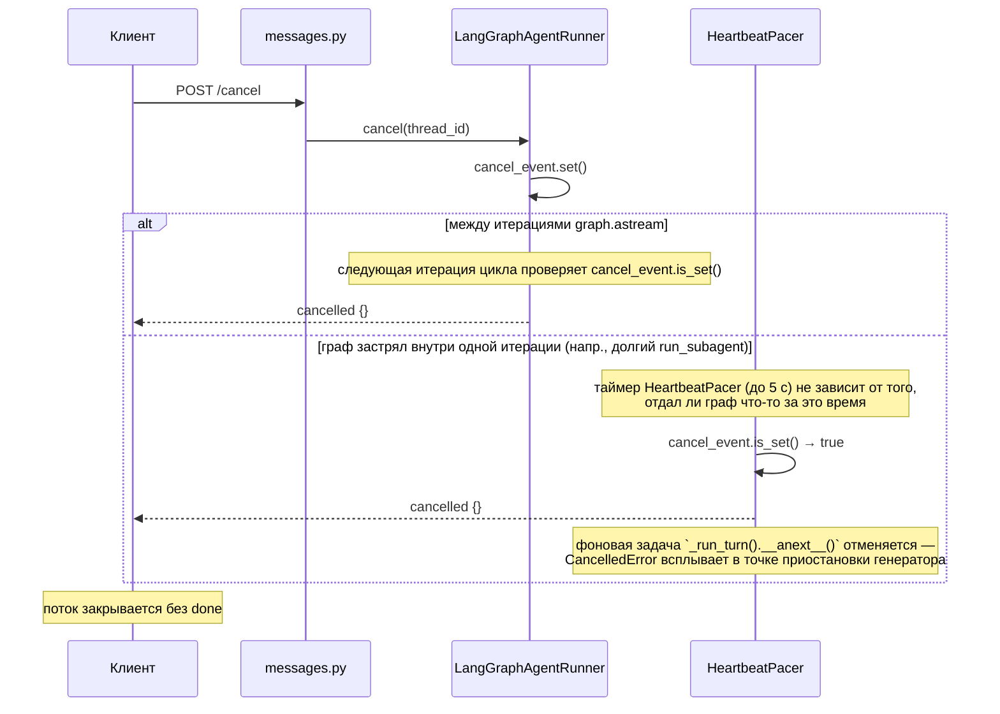

# SSE Streaming

Кросс-сервисный контракт: backend транслирует ход работы агента в поток событий, frontend потребляет его через native `fetch` + `ReadableStream`. Транспорт — Server-Sent Events (SSE) поверх POST-запроса (не `EventSource` — нужны request body и `Bearer`-заголовок).

Два принципа, определяющие состав контракта: **молчаливого UX не существует** (в любой момент генерации на проводе что-то живёт — открытие потока, исполнение инструмента, ревью ответа) и **прозрачность по умолчанию** (наружу идёт всё, что можно показать пользователю красиво; исключения — security-детали и мысли суммаризатора — сознательные, не побочный эффект фильтра).

## Формат провода

Одно сообщение пользователя → один SSE-поток → одно терминальное событие (`done` | `error` | `security_block` | `cancelled`). Каждое событие — JSON-объект с обязательным полем `type` и type-specific payload'ом, разделитель — двойной перевод строки:

```
data: {"type": "stream_started"}\n\n
data: {"type": "reasoning_chunk", "content": "Нужно проверить..."}\n\n
data: {"type": "text_chunk", "content": "Вот что я нашёл"}\n\n
data: {"type": "tool_call_started", "call_id": "abc-123", "tool": "firecrawl_search"}\n\n
data: {"type": "tool_call_args", "call_id": "abc-123", "args": "{\"query\": \"...\"}", "truncated": false}\n\n
data: {"type": "tool_result", "call_id": "abc-123", "tool": "firecrawl_search", "status": "success", "content": "...", "truncated": false}\n\n
data: {"type": "done", "message_id": "msg-uuid", "trace_id": "trace-uuid"}\n\n
```

## Состав событий

| Type | Payload | Источник | Терминальное |
|------|---------|----------|:---:|
| `stream_started` | `{}` | немедленно при открытии потока, до setup-фазы (резолв модели, MCP-инструментов, сборка графа, guard USER_INPUT) | |
| `heartbeat` | `{}` | таймер: 5 с без других событий, в любой точке рана (setup, исполнение инструмента, ревью) | |
| `reasoning_chunk` | `{content}` | messages-канал, `AIMessageChunk.additional_kwargs["reasoning"]` | |
| `text_chunk` | `{content}` | messages-канал, `AIMessageChunk.content` | |
| `tool_call_started` | `{call_id, tool, parent_call_id?}` | **ранний**: первый `tool_call_chunk` вызова в messages-канале (имя инструмента известно уже на нём) | |
| `tool_call_args` | `{call_id, args, truncated}` | момент, когда накопленная строка args становится валидным JSON (вызов дописан, до исполнения); `args` усечены | |
| `tool_call_cancelled` | `{call_id}` | вызов срезан guard'ом `TOOL_CALL_ARG` после генерации, до исполнения | |
| `tool_result` | `{call_id, tool, status, content, truncated, parent_call_id?}` | завершение исполнения, updates-канал; `status`: `success` \| `error`; `content` усечён | |
| `agent_event` | `{kind, payload, parent_call_id?}` | custom-канал (`get_stream_writer`): `sphere_write`, `memory_write`, `skill_context_write`, `compaction` | |
| `artifact_created` | `{id, title, artifact_type}` | по наличию `ToolMessage.artifact` (не по имени инструмента) | |
| `final_output_review_started` / `final_output_review_complete` | `{}` | вокруг end-of-stream FINAL_OUTPUT-классификатора — только когда ход дал непустой `full_response` | |
| `security_block` | `{}` | любой из четырёх runtime-чекпоинтов защиты выдал вердикт INJECTION (см. «Security-чекпоинты» ниже) | ✔ |
| `cancelled` | `{}` | отмена пользователем через `POST /cancel` | ✔ |
| `error` | `{detail}` | необработанное исключение в ходе рана; `detail` — из `configs/error_messages.yaml` | ✔ |
| `done` | `{message_id, trace_id}` | генерация завершена без блокировки/отмены/ошибки | ✔ |
| `trace_id` | `{trace_id}` | internal: перехватывается `ChatService`, клиенту не пробрасывается напрямую | |

Удалены относительно предыдущей версии контракта: `tool_start`, `tool_end` — их сигналы разошлись по двум более точным событиям: ранний старт вызова ушёл в messages-канал (`tool_call_started`, до завершения узла `agent`), а факт завершения — в `tool_result` с явным `status`.

### Уточнения по отдельным событиям

**`tool_call_started` / `tool_call_args`.** Имя инструмента и `call_id` известны уже на первом фрагменте `tool_call_chunks` — `tool_call_started` уходит на этом фрагменте, не дожидаясь завершения узла `agent`. Аргументы дописываются токенами; `tool_call_args` эмитится один раз, в момент, когда накопленная строка успешно парсится как JSON (`TokenChunkMapper._is_complete_json`) — это и означает «вызов дописан», ещё до исполнения. Сборка ведётся per-run (`TokenChunkMapper`, свежий инстанс на каждый `stream()`), не на разделяемом между стримами состоянии.

**`tool_call_cancelled`.** Guard `TOOL_CALL_ARG` (`tool_guards.guard_tool_call_args`) может срезать `tool_calls` уже сгенерированного хода, если аргументы несут инъекцию. К моменту, когда отредактированный `AIMessage` доходит до updates-канала, `tool_calls` уже пусты — сигнал среза восстанавливается по признаку `AIMessage` (не `ToolMessage` — тот же флаг `security_redacted` независимо ставит `guard_tool_results` на TOOL_RESULT-редакции) без `tool_calls` и с `additional_kwargs["security_redacted"]`. `StreamEventMapper` ведёт per-run список анонсированных, но ещё не разрешённых `call_id` (`note_call_announced`, вызывается раннером на каждом `tool_call_started`) и эмитит `tool_call_cancelled` для всех, что остались непогашенными `tool_result`.

**`tool_result` / `artifact_created`.** `status` берётся напрямую из `ToolMessage.status`. `artifact_created` эмитится по наличию `ToolMessage.artifact` (инструмент вернул его через `response_format="content_and_artifact"`) — не по whitelist имён; событие следует сразу за `tool_result` того же вызова.

**`agent_event`.** Custom-канал несёт два разных семейства сообщений: доменные события наших инструментов (`sphere_write` / `memory_write` / `skill_context_write` / `compaction` — единственные `kind`, перечисленные в `agent_events.DOMAIN_AGENT_EVENT_KINDS`) раннер оборачивает в `{type: "agent_event", data: {kind, payload, parent_call_id?}}`; lifecycle-события инструментов субагента (см. «Вложенность субагента» ниже) уже приходят в форме готового wire-события и пробрасываются как есть, без обёртки — на проводе они неотличимы от одноимённых событий основного агента, кроме поля `parent_call_id`.

**`final_output_review_*`.** Эмитятся, только если ход дал непустой текстовый ответ (`full_response`) и до этого момента не было блокировки — ход, закончившийся исключительно tool-вызовом без последующего текста, не порождает пары `final_output_review_started`/`_complete` вообще.

**`security_block`.** Payload всегда пустой — `reason` / `checkpoint` / `detection_layer` не покидают сервер (остаются в Langfuse/SIEM через `RuntimeSecurityEnforcer`/`AgentRunSpan`); пользователю показывается только сам факт блокировки. Эмитируется в одной из четырёх точек, подробнее — «Security-чекпоинты» ниже.

**`error`.** `detail` берётся из `configs/error_messages.yaml` через `error_mapper.normalize_error_message` для исключений, пойманных внутри рана (`_run_turn`). Отдельно от этого пути в `api/routes/messages.py`'s `_event_generator` есть транспортный fallback: если итерация по потоку событий бросает исключение (например, сбой сериализации JSON), клиенту уходит `{"type": "error", "detail": "Stream failed"}` — строка литеральная, не ключ `error_messages.yaml` (в файле нет ни значения, ни ключа с этим текстом). Расхождение подтверждено, не исправлено этой ревизией документа — это единственное место в контракте, где `error.detail` не проходит через `ErrorMessagesConfig`.

**`done`.** `message_id` резолвится post-hoc в `ChatService` (`get_last_ai_message_id`) уже после того, как раннер закрыл поток без терминального события — `done` эмитится не раннером, а `ChatService.send_message`.

**`trace_id`.** `ChatService` перехватывает событие (не пробрасывает клиенту напрямую), сохраняет `trace_id` в Redis вместе с `message_id`, включает его в payload `done`.

## Forward-compat

Контракт растёт: новые `kind` в `agent_event`, новые типы событий верхнего уровня (пример — будущий `title_updated`) добавляются без версионирования пути. Требование к потребителю: неизвестный `type` в `event_generator`/на фронте логируется и игнорируется, не приводит к ошибке обработки потока — переключатель по `event.type` не должен ронять диспетчер на неизвестном значении.

## Лимиты

- **Усечение.** `args` / `content` (tool-результат) / `payload`-строки `agent_event` — единый лимит **2 000 символов** + флаг `truncated`, один хелпер (`app/agent/text_limits.truncate`) на весь SSE-контракт и на `tool_call`-parts в API-истории (§ «История: typed parts» ниже) — лимит бизнес-инвариант в коде, не env.
- **Heartbeat.** Таймер **5 с** тишины (`HEARTBEAT_INTERVAL_SECONDS`, `app/agent/heartbeat.py`) — событие уходит в любой точке рана, где источник ничего не отдал за интервал.
- **Таймаут клиента от heartbeat.** Контракт для потребителя: соединение считается потерянным после **3 пропущенных heartbeat подряд** (~15 с полной тишины на проводе) — это заменяет прежний таймаут по first-byte, бессмысленный при SSE (HTTP-заголовки уходят сразу вместе с `stream_started`, поэтому first-byte-таймер измерял не рабочее состояние стрима, а факт открытия соединения).

## Вложенность субагента

`run_subagent` — обычный tool-вызов основного графа: его собственные `tool_call_started` / `tool_call_args` / `tool_result` ничем не отличаются от любого другого вызова. Внутри, пока субагент исполняет *свои* инструменты, каждый такой вызов даёт те же четыре типа событий, что и вызов инструмента основным агентом, с добавленным `parent_call_id` = `call_id` вызова `run_subagent`:

- `tool_call_started {call_id, tool, parent_call_id}`
- `tool_call_args {call_id, args, truncated, parent_call_id}` — у субагента оба события уходят одно за другим: его `ToolNode` передаёт уже полностью распарсенные `args` (не по фрагментам, как в messages-канале основного агента), собирать нечего.
- `tool_result {call_id, tool, status, content, truncated, parent_call_id}`
- `agent_event {kind, payload, parent_call_id}` — если исполняемый инструмент субагента сам вызывает `emit_agent_event` (KS/memory/skill-context доступны субагенту через общий tool pool).

Механизм: `run_subagent` исполняется в скоупе основного графа, где `get_stream_writer()` работает штатно — тул захватывает этот writer и собственный `call_id` (через инжектируемый `ToolRuntime`) и передаёт их явно в `SubagentRunner.run(stream_writer=..., parent_call_id=...)`. `SubagentRunner` оборачивает каждый резолвленный инструмент субагента в `_LifecycleEmittingTool` (`subagents/runner.py`) — тонкий `BaseTool`-прокси, который перед исполнением эмитит `tool_call_started`/`tool_call_args` напрямую в переданный `stream_writer`, вокруг вызова выставляет контекстные переменные `SUBAGENT_STREAM_WRITER`/`SUBAGENT_PARENT_CALL_ID` (`agent_events.py`, `.set()`/`.reset(token)` в `finally`), а по завершении — `tool_result`.

Явная передача writer'а, а не `get_stream_writer()` внутри субагентского графа, — не альтернатива на вкус, а единственный рабочий вариант: субагент — отдельно скомпилированный Pregel-граф, вызываемый `ainvoke` (не `astream`), поэтому его собственный custom-стрим никто не читает — `get_stream_writer()` там резолвится корректно, но результат уходит в никуда. Проверено экспериментально на langgraph 1.1.3: custom-события вложенного скомпилированного графа не всплывают в родительский поток при `astream(subgraphs=False)`; `subgraphs=True` дал бы всплытие через namespace, но меняет форму кортежа стрима на `(namespace, mode, data)` и требует пересмотра фильтра `SUBAGENT_TAG` — отклонено как более инвазивное решение с тем же результатом.

Вход субагента (`task`) и его финальный ответ отдельным каналом не эмитятся — это `args`/`content` самого вызова `run_subagent`, уже покрытые обычными `tool_call_args`/`tool_result` внешнего вызова.

## Изоляция токенов: субагент и суммаризатор

Два разных источника лишних LLM-генераций, две разные техники изоляции:

- **Субагент** — тегирование + фильтр на приёме. Каждый `ainvoke` субагентского графа помечен тегом `subagent` (`SUBAGENT_TAG`, `subagents/runner.py`); в цикле `graph.astream` раннера чанки messages-канала с этим тегом в metadata отбрасываются **до** проверки `isinstance(..., AIMessageChunk)`, **до** накопления `full_response`/`last_message_id` и **до** canary/mid-stream-проверок. `cancel_event` при этом продолжает проверяться на каждой итерации — отмена остаётся отзывчивой и во время рана субагента.
- **Суммаризатор** — изоляция на источнике, не на приёме. `_reduce_context` (`graph.py`) вызывает `summarization_model.ainvoke(...)` с явным `RunnableConfig` (`callbacks: []`, `tags=["context_summarization"]`), по образцу security-классификатора (`security/classifier.py`) — сгенерированные токены компакции никогда не попадают в callback-цепочку родительского рана, а значит никогда не появляются в `stream_mode="messages"` вообще. Тегировать и фильтровать их на приёме, как токены субагента, не потребовалось бы даже теоретически: они физически не текут в тот же стрим.

Факт компакции (не её содержимое) виден в ленте как `agent_event {kind: "compaction", payload: {}}`, эмитируемый сразу после успешной сборки `ops_prefix` (не в ветке отказа суммаризации — там компакции не произошло).

## Security-чекпоинты

`RuntimeSecurityEnforcer` держит четыре runtime-чекпоинта; при вердикте INJECTION на любом — `security_block {}` и (кроме первого) редакция сообщения в чекпоинтере + пометка треда заблокированным:

1. **`USER_INPUT`** (`check_user_input`) — до старта графа, сразу после setup-фазы. При INJECTION граф вообще не запускается: в чекпоинтер реплеится пара `HumanMessage` + redaction-заглушка (иначе при переоткрытии чата пользователь не увидел бы ни свой ввод, ни ответ), `security_block` уходит немедленно.
2. **`FINAL_OUTPUT`, mid-stream** (`check_mid_stream`) — на каждом `text_chunk`, детерминированная проверка хвоста ответа (canary + паттерны, `skip_classifier=True` — без LLM-классификатора, для скорости на каждом токене).
3. **`FINAL_OUTPUT`, end-of-stream** (`check_final_output`) — после завершения `graph.astream`, полный LLM-классификатор по всему `full_response`; выполняется только если ход дал непустой текст и предыдущие чекпоинты не сработали. Обёрнут парой `final_output_review_started`/`_complete`.
4. **Post-stream in-graph inspection** (`inspect_in_graph`) — сканирует последний ход в чекпоинтере на признак `security_redacted`, оставленный **inline**-проверками `TOOL_RESULT`/`TOOL_CALL_ARG` (`tool_guards.py`), сработавшими прямо внутри графа во время исполнения (не через отдельное SSE-событие в момент срабатывания — сигнал виден только post-hoc, сканом).

Четвёртый чекпоинт выполняется **после** третьего — то есть `security_block` может прийти уже вслед за `final_output_review_complete`, а не вместо него: ответ прошёл end-of-stream проверку чисто, но постфактум обнаруживается, что где-то в ходе (аргумент tool-вызова или его результат) сработала inline-редакция. Терминальное `security_block` в этом случае — последнее событие потока, `done` не эмитится (см. «ChatService» ниже).

Отдельно от этих четырёх — **pre-stream гейт**: `POST /messages` защищён FastAPI-зависимостью `require_unblocked_thread` (`api/deps.py`), которая до создания `StreamingResponse` проверяет, не помечен ли тред уже заблокированным (`ThreadViewRepository.is_security_blocked`), и при да — отвечает `403 Thread blocked by security policy` вместо открытия потока. Это не событие контракта SSE, а обычный HTTP-статус: тред, однажды заблокированный любым из четырёх чекпоинтов, отклоняет дальнейшие сообщения на уровне API, не на уровне стрима.

## Stream Lifecycle



`error {detail}` может прийти вместо `done` на любом шаге внутри `loop`/`opt`-блоков — необработанное исключение в `_run_turn` завершает ран тем же образом, что и блокировка (терминально, без `done`).

## Cancellation

Два независимых механизма проверки одного и того же `cancel_event` (`asyncio.Event` per `thread_id`) — не резервный/основной, а два места, где отмена может быть замечена в зависимости от того, где именно граф находится в момент вызова `POST /cancel`.



- **Между итерациями `astream`** — как и раньше, самый быстрый путь: цикл раннера проверяет `cancel_event.is_set()` на каждой итерации.
- **На таймере `HeartbeatPacer`** — не зависит от того, работает ли граф внутри одной итерации (долгий tool-вызов, `run_subagent`): пейсер гонит `_run_turn().__anext__()` как фоновую задачу против того же 5-секундного таймера, что и heartbeat, и на каждом истечении интервала проверяет `cancel_event` независимо от результата задачи-источника — поэтому отмена отзывчива и во время исполнения инструмента, не только между шагами графа.
- **Pending cancel** — если `POST /cancel` приходит до того, как для треда создан `cancel_event` (стрим ещё не стартовал), thread_id запоминается в `_pending_cancels` и событие устанавливается сразу при следующем `stream()`.
- **Hard cancel** — `AbortController.abort()` на клиенте разрывает fetch-соединение напрямую; фоллбэк, если graceful cancel не сработал (сервер не ответил) или при размонтировании компонента.

## Backend: генерация событий

### LangGraphAgentRunner

`stream()` — генератор с двумя слоями: внешний слой отдаёт `stream_started`, оборачивает `_run_turn()` (внутренняя корутина: setup + guard + цикл `graph.astream` + review-проверки) в `HeartbeatPacer.pace()` и ретранслирует события пейсера; `finally` внешнего слоя безусловно чистит `_cancel_events`/`_pending_cancels` — на любом выходе (успех, исключение setup-фазы, ранний `return` на заблокированном USER_INPUT).

Внутри `_run_turn()`, `graph.astream(..., stream_mode=["messages", "updates", "custom"])` — три канала:

- **`messages`** — сырые `AIMessageChunk`; чанки с тегом `subagent` в metadata отбрасываются раньше любой другой обработки (см. «Изоляция токенов» выше), остальные разбираются `TokenChunkMapper` (`stream_events.py`) на `text_chunk` / `reasoning_chunk` / `tool_call_started` / `tool_call_args`. Только `text_chunk` копится в `full_response` и уходит на canary/mid-stream проверку — reasoning и tool-call-события идут live без участия guard'а (осознанная граница: reasoning-модели отдают уже суммированные рассуждения, а не сырой ввод пользователя).
- **`updates`** — апдейты узлов `agent`/`tools`; разбираются `StreamEventMapper` в `tool_result` / `artifact_created` / `tool_call_cancelled`.
- **`custom`** — конверты от `get_stream_writer()`: доменные `kind` из `agent_events.DOMAIN_AGENT_EVENT_KINDS` оборачиваются в `agent_event`, lifecycle-конверты субагентской обёртки пробрасываются как готовые wire-события (см. «Вложенность субагента»).

Коллабораторы (инжектируются в конструктор, у каждого — фабрика, а не общий инстанс, там где нужно per-run состояние — module-level shared state между параллельными пользовательскими стримами запрещено):

| Коллаборатор | Ответственность |
|--------------|-----------------|
| `RuntimeSecurityEnforcer` | Четыре runtime-чекпоинта (см. выше) + редакция сообщений + пометка треда заблокированным |
| `AgentRunTracer` / `AgentRunSpan` | Langfuse-спан рана: score, finalize-on-block, output, mid-stream observation |
| `CheckpointHistory` | Чтение чекпоинтера: `raw_messages`, `history()` → typed parts, `last_ai_message_id`, `latest_redaction` |
| `TokenChunkMapper` | `stream_mode="messages"` chunk → `text_chunk`/`reasoning_chunk`/`tool_call_started`/`tool_call_args`; фабрика — новый инстанс на каждый `stream()` |
| `StreamEventMapper` | `stream_mode="updates"` → `tool_result`/`artifact_created`/`tool_call_cancelled`; фабрика — новый инстанс на каждый `stream()` |
| `HeartbeatPacer` | `heartbeat {}` в любой тишине + проверка `cancel_event` на том же таймере |

Отмена: `client_disconnected` в финальном логе (`"agent completed"`) отличает настоящий обрыв клиента от собственной отмены — `cancel_event.is_set()` в момент перехвата `CancelledError`/`GeneratorExit` решает, какой из двух это был.

### ChatService

`send_message()` — relay + post-hoc:

1. Валидирует существование чата (defense in depth — `require_unblocked_thread`/ownership-зависимости уже проверили это на уровне API), обновляет `updated_at`.
2. Проксирует события `AgentRunner.stream()` клиенту; перехватывает `trace_id` (не форвардит), копит `artifact_created.id` в список.
3. `stream_ended_without_done`: `True`, если раннер уже отдал `error` / `security_block` / `cancelled` — три терминальных события взаимоисключающи с `done`; в этом случае post-hoc и синтетический `done` пропускаются целиком.
4. Иначе — post-hoc: `get_last_ai_message_id()`, привязка артефактов к сообщению (`ArtifactRepository.set_message_id`), сохранение `trace_id` в Redis, эмиссия `done {message_id, trace_id}`.

### API Layer

`_event_generator()` (`api/routes/messages.py`) — маппинг `StreamEvent` → SSE wire format (`data: {json}\n\n`); оборачивает итерацию в `try/except`, транспортный fallback на любое необработанное исключение (сбой сериализации, обрыв на уровне ASGI) — `error {"detail": "Stream failed"}`, мимо `error_messages.yaml` (см. «Уточнения по отдельным событиям» выше).

| Header | Значение | Назначение |
|--------|----------|------------|
| Content-Type | text/event-stream | SSE MIME type |
| Cache-Control | no-cache | Запрет кэширования промежуточными прокси |
| X-Accel-Buffering | no | Отключение буферизации в Nginx |

Два fail-fast гейта до открытия потока: ownership чата (thread/project dependency, HTTP 404 при чужом/несуществующем чате) и `require_unblocked_thread` (HTTP 403, см. «Security-чекпоинты»).

## История: typed parts

`GET /projects/{id}/chats/{cid}` отдаёт `MessageOut.parts` — упорядоченный список typed-частей ассистентского сообщения, собранный `CheckpointHistory.history()` из того же чекпоинтера, что видит live-стрим (без новой персистентности, без миграций):

| Part | Поля | Источник в чекпоинте |
|------|------|----------------------|
| `reasoning` | `content` | `AIMessage.additional_kwargs["reasoning"]` |
| `text` | `content` | `AIMessage.content` |
| `tool_call` | `call_id, tool, args, status, result_preview, truncated` | `AIMessage.tool_calls` + парный `ToolMessage` по `tool_call_id` (`status`: `success` \| `error` \| `pending`) |

Один ход агента = один `MessageOut` с последовательностью `parts`, а не сообщение на каждое сырое LangChain-сообщение чекпоинта: границы хода — от `HumanMessage` до следующего `HumanMessage`; всё между ними (tool-calling `AIMessage`, `ToolMessage`, финальный `AIMessage`) складывается в один ассистентский `Message`. `id`/`created_at` берутся у финального `AIMessage` без `tool_calls` (тот же якорь, на который резолвятся `trace_id`/`feedback_score`/`artifacts`), а если ход оборвался на tool-вызове — у последнего доступного `AIMessage`; непарный `ToolMessage` в этом случае даёт `tool_call`-part со `status="pending"` — третье значение статуса, которого нет в SSE-контракте (там `tool_result` всегда либо `success`, либо `error`, потому что живой стрим либо разрешает вызов, либо обрывает ран целиком).

Сообщения до первого `HumanMessage` треда в `parts` не попадают — после компакции `_reduce_context` кладёт в чекпоинт id-less `summary_msg`, это служебная сводка контекста, не ход, в котором участвовал пользователь. `redacted`-сообщение (любой из четырёх runtime-чекпоинтов) отдаёт единственный `text`-part с redaction-заглушкой, без `reasoning` — даже если исходный `AIMessage` (случай `guard_tool_call_args`) нёс настоящий `reasoning`: показ «безобидной» половины сообщения, вызвавшего блокировку, был бы более узкой политикой, чем действующая для `content` (полная замена на заглушку).

Осознанная граница: вложенная хронология субагента (его `tool_call_*`/`tool_result`/`agent_event` с `parent_call_id`) и факт компакции в `parts` не попадают — оба live-only, эфемерны для custom-канала и не пишутся в чекпоинт основного графа. В истории субагентский ход виден как один `tool_call`-part вызова `run_subagent` (task в `args`, вердикт в `result_preview`), без вложенных строк. Детальная хронология остаётся в Langfuse.

## Frontend: потребление стрима

Полная реализация — `frontend/src/pages/chat/model/useAgentStream.ts` и `frontend/src/stores/stream-store.ts` (см. [frontend.md](frontend.md#sse-стриминг) для карты компонентов). Контракт потребления, стабильный независимо от внутреннего устройства store:

- **Диспетчеризация по `event.type`** — один хук читает `ReadableStream` чанками, парсит SSE-фреймы (буфер неполных строк), диспетчерит по `type` в обновление state/инвалидацию кэша/колбэки; неизвестный `type` не должен прерывать поток или падать (forward-compat, § выше) — существующий диспетчер (`switch` без `default`) уже не падает на нём, но и не логирует его отдельно.
- **Отмена** — `POST /cancel` (устанавливает `cancel_event` на сервере), с фоллбэком на `AbortController.abort()`, если сервер не ответил или компонент размонтирован. Флаг на клиенте отличает пользовательскую отмену от реальной ошибки — при отмене error-toast не показывается.
- **Таймаут** — от heartbeat (см. «Лимиты»), не от факта получения первого байта: HTTP-заголовки и `stream_started` приходят сразу, first-byte-таймер измерял бы только открытие соединения, не работу стрима.
- **Store — не source of truth.** Эфемерное состояние на время стрима; после `done` данные рефетчатся с сервера через TanStack Query.

TanStack Query invalidation на ключевых событиях:

| Событие | Invalidated queries | Зачем |
|---------|-------------------|-------|
| `artifact_created` | `["projects", projectId, "artifacts"]` | Новый артефакт в списке |
| `done` | `["projects", projectId, "chats", chatId]`, `["chats", "recent"]` | Полное сообщение с сервера (включая `parts`), обновление списка чатов |

## API Endpoints

| Method | Path | Назначение | Auth |
|--------|------|-----------|------|
| POST | `/api/projects/{id}/chats/{cid}/messages` | Отправить сообщение, получить SSE-поток | Bearer |
| POST | `/api/projects/{id}/chats/{cid}/cancel` | Отменить генерацию | Bearer |
