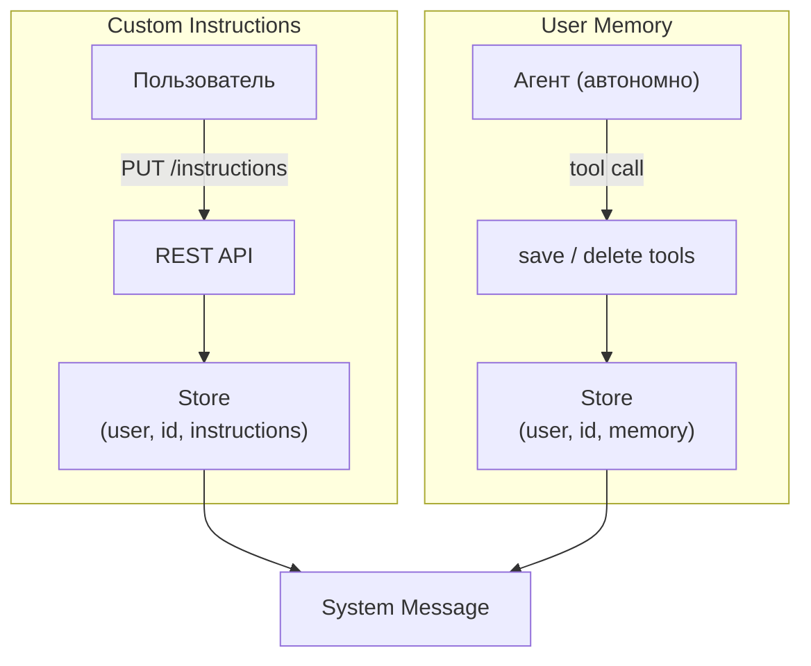

# User Memory

Кросс-проектная персонализация агента: два механизма с разным ownership. Custom Instructions задаёт пользователь, User Memory ведёт агент автономно. Оба попадают в system message каждого вызова — [agent-runtime.md](agent-runtime.md).

Отличие от Knowledge Sphere: KS — per-project проектные знания, управляемые агентом. User Memory — per-user, кросс-проектная, о самом пользователе.

## Concept



| Механизм | Ownership | Scope | Хранение | Попадание в system message |
|----------|-----------|-------|----------|---------------------------|
| Custom Instructions | Пользователь | Per-user, cross-project | Единственная запись | `<custom_instructions>` блок |
| User Memory | Агент (автономно) | Per-user, cross-project | Коллекция key-value записей | `<user_memory>` index |

## Custom Instructions

Текстовые инструкции пользователя, влияющие на поведение агента. Свободный формат — от стиля общения до доменных предпочтений.

- Scope: per-user, одни на все проекты и чаты
- Лимит: 5000 символов
- Инъекция: `<custom_instructions>` блок в system message (условный — пустые инструкции не добавляются)
- Управление: REST API + UI (`/settings`)

## User Memory

Факты о пользователе, которые агент собирает автономно в процессе диалога. Агент сам решает, когда информация стоит запоминания.

Каждая запись:

| Поле | Описание |
|------|----------|
| `key` | Уникальный идентификатор (lowercase, hyphens: `prefers-bullet-points`) |
| `description` | Однострочное описание (для index в system message) |
| `content` | Полное содержание факта |

Инъекция в system message: форматированный index через `format_index()` — список `key: description`. Агент видит, что он знает о пользователе, и использует это для персонализации.

### Agent Tools

| Tool | Назначение |
|------|------------|
| `save_user_memory(key, description, content)` | Сохранить/обновить факт (upsert by key) |
| `delete_user_memory(key)` | Удалить устаревший или некорректный факт |

Агент вызывает tools автономно — нет явных команд от пользователя. Типичные триггеры: пользователь упоминает предпочтения, уровень опыта, рабочий контекст, стилистические пожелания.

## Storage

LangGraph Store (`AsyncPostgresStore`) — общий бэкенд с Knowledge Sphere (обоснование — [ADR-015](adr/ADR-015-langgraph-store-unified-memory.md)).

### Namespace Hierarchy

```
("user", {user_id}, "instructions")   →  key: "default"
                                          value: { content: str }

("user", {user_id}, "memory")         →  key: "{memory-key}"
                                          value: { description: str, content: str }
```

Для сравнения — Knowledge Sphere:
```
("project", {project_id}, "sphere")   →  key: "{section_id}"
```

`format_index()` — generic helper, используемый и для KS Index, и для User Memory Index. Принимает store items, сортирует по `created_at`, форматирует в читаемый список.

## REST API

| Method | Path | Назначение |
|--------|------|------------|
| `GET` | `/api/users/me/instructions` | Получить custom instructions |
| `PUT` | `/api/users/me/instructions` | Обновить (пустой `content` — очистить) |
| `GET` | `/api/users/me/memories` | Список всех agent memories |
| `DELETE` | `/api/users/me/memories/{key}` | Удалить запись (204 No Content) |

Аутентификация: JWT (как все endpoints). Memories read-only для пользователя через API — создание и обновление только через agent tools.

`PUT /instructions` проходит security guard (`custom_instructions_write` checkpoint, → [security/architecture.md](../security/architecture.md)); при INJECTION — HTTP 422, запись не выполняется.

## Frontend

Страница `/settings` — две секции:

- **Custom Instructions** — textarea с лимитом 5000 символов, dirty-state tracking, кнопка Save
- **Agent Memory** — read-only список записей (key, description, content) с возможностью удаления

Подробнее о компонентах — [frontend.md](frontend.md).
