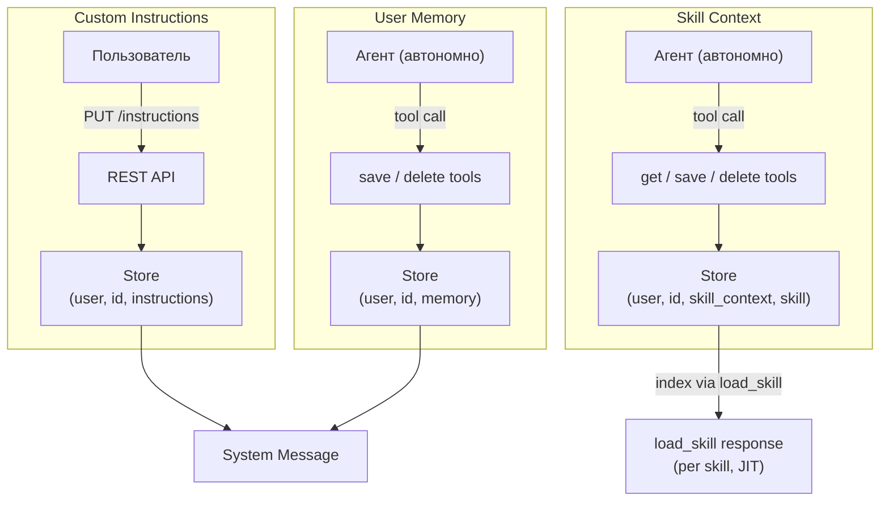

# User Memory

Персонализация агента поверх LangGraph Store: три механизма с разным ownership и scope. Custom Instructions задаёт пользователь; User Memory и Skill Context ведёт агент автономно. Custom Instructions и User Memory попадают в system message каждого вызова — [agent-runtime.md](agent-runtime.md). Skill Context — иначе: per-skill, доставляется через `load_skill`, не постоянной секцией (см. ниже).

Отличие от Knowledge Sphere: KS — per-project проектные знания, управляемые агентом. User Memory и Skill Context — per-user (Skill Context дополнительно per-skill), о самом пользователе, а не о проекте.

## Concept



| Механизм | Ownership | Scope | Хранение | Попадание в контекст агента |
|----------|-----------|-------|----------|---------------------------|
| Custom Instructions | Пользователь | Per-user, cross-project | Единственная запись | `<custom_instructions>` блок в system message |
| User Memory | Агент (автономно) | Per-user, cross-project | Коллекция key-value записей | `<user_memory>` index в system message |
| Skill Context | Агент (автономно) | Per-user, per-skill | Коллекция key-value записей на скилл | Index в ответе `load_skill` (JIT, не system message) |

## Custom Instructions

Текстовые инструкции пользователя, влияющие на поведение агента. Свободный формат — от стиля общения до доменных предпочтений.

- Scope: per-user, одни на все проекты и чаты
- Лимит: 5000 символов
- Инъекция: `<custom_instructions>` блок в system message (условный — пустые инструкции не добавляются)
- Управление: REST API + UI (`/settings`)

## User Memory

Факты о пользователе, которые агент собирает автономно в процессе диалога. Агент сам решает, когда информация стоит запоминания.

Каждая запись:

| Поле | Описание |
|------|----------|
| `key` | Уникальный идентификатор (lowercase, hyphens: `prefers-bullet-points`) |
| `description` | Однострочное описание (для index в system message) |
| `content` | Полное содержание факта |

Инъекция в system message: форматированный index через `format_index()` — список `key: description`. Агент видит, что он знает о пользователе, и использует это для персонализации.

### Agent Tools

| Tool | Назначение |
|------|------------|
| `save_user_memory(key, description, content)` | Сохранить/обновить факт (upsert by key) |
| `delete_user_memory(key)` | Удалить устаревший или некорректный факт |

Агент вызывает tools автономно — нет явных команд от пользователя. Типичные триггеры: пользователь упоминает предпочтения, уровень опыта, рабочий контекст, стилистические пожелания.

## Skill Context

Per-user коллекция документов, привязанная к конкретному скиллу: профили стиля, образцы, предпочтения. Любой скилл может завести такую коллекцию; первый пример — профиль авторского голоса `tech-article-writing`.

Отличие от User Memory: та кросс-проектна и ограничена только пользователем; Skill Context дополнительно скопирован по скиллу — namespace несёт имя скилла четвёртым элементом, а доставка привязана к вызову конкретного скилла, а не идёт в system message каждого запроса. Развязка хранения и доставки решает вопрос жизненного цикла: данные в Store живут независимо от присутствия скилла в библиотеке (удаление или переименование скилла не стирает контекст), доставка же прекращается сама собой — нет скилла, некому вызвать `load_skill`.

Каждый документ:

| Поле | Описание |
|------|----------|
| `key` | Идентификатор документа в рамках скилла (`profile`, `sample-habr-sofa`, …) |
| `description` | Однострочное описание (для индекса, дописываемого в ответ `load_skill`) |
| `content` | Полное содержание документа |

### Agent Tools

| Tool | Назначение |
|------|------------|
| `get_skill_context(skill_name, key)` | Получить полное содержимое документа |
| `save_skill_context(skill_name, key, description, content)` | Сохранить/обновить документ (upsert по `key`); отклоняет запись под несуществующий или опечатанный скилл |
| `delete_skill_context(skill_name, key)` | Удалить документ |

Лимиты (бизнес-инварианты, не env): `content` ≤ 20 000 символов, `description` ≤ 200, ≤ 20 документов на скилл — проверяется только при создании нового `key`, upsert существующего документа лимитом количества не ограничен.

### Доставка: load_skill, не system message

Ключевое отличие от Custom Instructions и User Memory: контекст скилла не лежит в system message постоянно. Агент видит индекс документов (`key: description`) только когда вызывает `load_skill(skill_name)` — индекс дописывается к обычному выводу скилла, и только если namespace непуст (пустая коллекция — вывод `load_skill` не меняется). Полное содержимое документа — отдельным вызовом `get_skill_context(skill_name, key)`, когда методология скилла этого требует. То же progressive disclosure, что применяется к самим скиллам — [agent-runtime.md § Context Engineering](agent-runtime.md#context-engineering), [agent-runtime.md § Skills System](agent-runtime.md#skills-system).

## Storage

LangGraph Store (`AsyncPostgresStore`) — общий бэкенд с Knowledge Sphere (обоснование — [ADR-015](adr/ADR-015-unified-memory-backend.md)).

### Namespace Hierarchy

```
("user", {user_id}, "instructions")   →  key: "default"
                                          value: { content: str }

("user", {user_id}, "memory")         →  key: "{memory-key}"
                                          value: { description: str, content: str }

("user", {user_id}, "skill_context", {skill_name})  →  key: "{doc-key}"
                                          value: { description: str, content: str }
```

Для сравнения — Knowledge Sphere:
```
("project", {project_id}, "sphere")   →  key: "{section_id}"
```

`format_index()` — generic helper, используемый и для KS Index, и для User Memory Index. Принимает store items, сортирует по `created_at`, форматирует в читаемый список.

## REST API

| Method | Path | Назначение |
|--------|------|------------|
| `GET` | `/api/users/me/instructions` | Получить custom instructions |
| `PUT` | `/api/users/me/instructions` | Обновить (пустой `content` — очистить) |
| `GET` | `/api/users/me/memories` | Список всех agent memories |
| `DELETE` | `/api/users/me/memories/{key}` | Удалить запись (204 No Content) |
| `GET` | `/api/users/me/skill-contexts` | Список документов, сгруппированных по скиллу (флаг `in_library` на группе) |
| `GET` | `/api/users/me/skill-contexts/{skill_name}/{key}` | Получить документ (404, если нет) |
| `PUT` | `/api/users/me/skill-contexts/{skill_name}/{key}` | Заменить существующий документ (`description` + `content` обязательны); 404, если документа ещё нет — создание только через agent tool |
| `DELETE` | `/api/users/me/skill-contexts/{skill_name}/{key}` | Удалить документ (204 No Content) |

Аутентификация: JWT (как все endpoints). Memories read-only для пользователя через API — создание и обновление только через agent tools. Для Skill Context симметрия иная: создание — только агент (upsert в `save_skill_context`), правка и удаление документа — агент и REST оба.

`PUT /instructions` проходит security guard (`custom_instructions_write` checkpoint, → [security/architecture.md](../security/architecture.md)); при INJECTION — HTTP 422, запись не выполняется. `PUT /skill-contexts/{skill_name}/{key}` — симметрично, через checkpoint `skill_context_write`; проверка существования документа (404) идёт первой, guard вызывается только для существующего документа.

## Frontend

Страница `/settings` — три секции:

- **Custom Instructions** — textarea с лимитом 5000 символов, dirty-state tracking, кнопка Save
- **Agent Memory** — read-only список записей (key, description, content) с возможностью удаления
- **Skill Context** («Контекст скиллов») — документы сгруппированы по скиллу; раскрытие документа — Markdown-превью, «Править» переключает на сырой `content` в textarea, «Удалить» без подтверждения. Скилл, отсутствующий в библиотеке, помечается бейджем — данные и действия остаются доступны. Создание документа из UI не предусмотрено — только агент

Подробнее о компонентах — [frontend.md](frontend.md).
