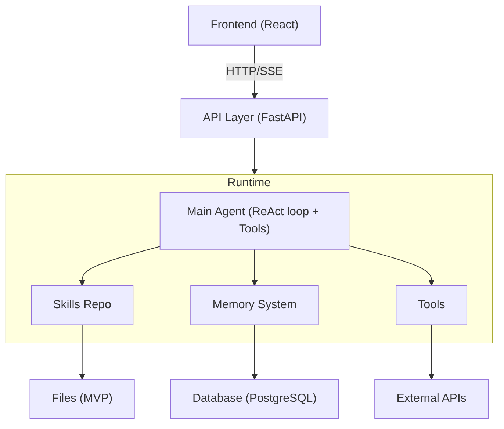

# LearnFlowAI — Техническое видение

## Принципы

### 1. Простота > сложность
Начинаем с одного General Agent. Мультиагентность — когда реально нужна, не заранее. Не переусложнять "на будущее".

### 2. Расширяемость через композицию
Основной способ расширения — добавление skills и tools. Дополнительный — создание sub-agents для изолированной логики. Код агента меняется редко, поведение — через конфигурацию.

### 3. Мультиагентность как абстракция
Аналогия с кодом: выносим в отдельный модуль, когда нужна изоляция и единый интерфейс. Критерии выноса в sub-agent: основной агент перегружен контекстом, чёткая граница ответственности, польза от изоляции > overhead на коммуникацию.

### 4. Polished few > Feature-rich
Качество системы — произведение, а не сумма качества частей. 3 фичи на 0.9 (= 0.729) лучше, чем 10 фич на 0.3 (≈ 0). На критичных точках (context engineering, quality of research, knowledge sphere) — запариваемся. На остальном — минимально рабочее. Предпочитаем гениально простые решения сложным: если ripgrep решает задачу не хуже RAG — берём ripgrep.

## Системная архитектура



**Frontend** — React UI, минимальный chat-интерфейс. Основной клиент на MVP.

**API Layer** — FastAPI. Async, типизация, OpenAPI. Принимает запросы, управляет сессиями, стримит ответы через SSE.

**Agent Runtime** — LangGraph. General Agent с ReAct loop, подключаемыми skills, memory system и tools.

**Database** — PostgreSQL. Хранение checkpoints (LangGraph), Knowledge Sphere, истории диалогов, артефактов.

Детальное описание компонентов — в технической документации (`doc/tech/`).

### Data Flow (типичный сценарий)

```
1. User → Frontend: "Помоги структурировать доклад о LangGraph"
2. Frontend → API: POST /chat {message, project_id}
3. API → Agent Runtime:
   - Загрузить шар знаний проекта
   - Запустить Main Agent
4. Main Agent:
   - Читает шар (контекст проекта)
   - Подгружает skill "structure"
   - Использует tools (research, generation)
   - Обновляет шар при необходимости (tool update_sphere)
   - Отвечает пользователю
5. Agent Runtime → API → Frontend: SSE stream response
```

Детали API, tools и механики обновления шара — в [backend.md](tech/backend.md).

## Технический стек

### Основной

| Компонент | Технология | Причина |
|-----------|------------|---------|
| Язык | Python | Стандарт для AI/ML, экосистема |
| API | FastAPI | Async, типизация, OpenAPI |
| Agent Framework | LangGraph | Гибкость, checkpoints, Store |
| Package Manager | uv | Быстрый, modern, workspace support |
| Frontend | React | Стандарт, компетенция, экосистема |
| Database | PostgreSQL | LangGraph support, надёжность |

### Инструменты разработки

| Инструмент | Назначение |
|------------|------------|
| Alembic | Миграции БД |
| ruff | Линтер + форматер |
| mypy | Статическая типизация |
| pre-commit | Хуки перед коммитом |
| Makefile | Dev-команды (lint, test, run, docker) |
| Docker + docker-compose | Контейнеризация |

**Критерии выбора:** де-факто стандарт в индустрии, AI-friendly (агенты хорошо работают, много документации), личный опыт и компетенция.

## API-first

LearnFlowAI — API-first. React-фронт — основной клиент на MVP, но API не завязан на него. Другие клиенты возможны без переделки архитектуры.

Перспективные каналы: MCP-сервер (подключение к внешним агентам), standalone-скиллы (отдельные репозитории как канал дистрибуции), Telegram-бот, CLI. Подробнее — в [roadmap.md](product/roadmap.md).

## MVP

### Критерий готовности

> **"Не стыдно показать"**

- Решение действительно решает поставленную проблему
- Базово всё работает
- Запускается локально и в Docker
- Чистая кодовая база
- Продуманная архитектура

### Принципы разработки

**Оптимизация vs архитектура:**
- Оптимизация: НЕ делаем преждевременно
- Архитектура: компромисс — не однобокая, но и не переусложнённая

**Критерий принятия решений:**

| Если... | То... |
|---------|-------|
| Переделка дороже | Делаем сразу правильно |
| Можно отложить | Упрощаем |

**Примеры:**
- Checkpointer → сразу PostgreSQL (переводить потом дороже)
- Skills → файловая система (достаточно для MVP)
- Линтеры/типизация → с первого дня (добавлять потом = рефакторить половину репо)

### Инженерные практики (с первого дня)

- Makefile (dev-команды)
- ruff (линтер + форматер)
- mypy (типизация)
- pre-commit hooks
- Docker + docker-compose
- Структура проекта (clean architecture)
- README с инструкцией запуска

## Оценка качества

Детерминированные метрики не подходят для агентной системы. Задача слишком специфична для стандартных бенчмарков (RAGAS и подобных). Нет числового индекса, который адекватно оценит качество работы агента.

**Feedback loop:**

```
Пользователь оставляет feedback → Langfuse (трейсы + scores)
    → LLM-агент анализирует трейсы (шаги, reasoning, обратная связь)
    → Системная картина → архитектору
    → Правки в system prompt
```

**Регрессионное тестирование:** фиксируем эталонные траектории после улучшений. При обновлениях проверяем, что качество не деградировало. Пофикшенные проблемы — regression-кейсы.
