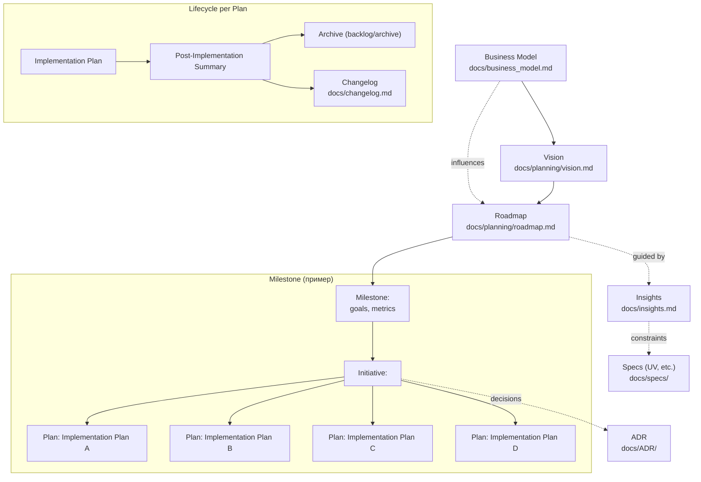

# Документация проекта (`docs/`)

Этот каталог — единая точка входа в проектную документацию для подхода AI‑Driven Development. Здесь хранится «истина в последней инстанции» о видении, дорожной карте, архитектурных решениях и планах реализации.

## Цели и принципы
- Поддерживать минимальный, но достаточный контекст для быстрой загрузки ассистента.
- Делать документы связными: от Vision → Roadmap → Initiatives → Implementation Plans → Summary/Changelog.
- Фиксировать решения и причины (ADR), избегая «устной истории».

## Структура каталога
- `overview.md` — обзор системы (что это и как устроено на высоком уровне).
- `business_model.md` — бизнес‑контекст и стратегия монетизации.
- `conventions.md` — соглашения по разработке (управление зависимостями, структура репо и т. п.).
- `ui_style_guide.md` — визуальный язык и UI‑гайд (если применимо).
- `ADR/` — архитектурные решения (Architecture Decision Records).
- `research/` — исследовательские заметки, сравнения, пробы.
- `specs/` — рабочие спецификации по технологиям/инструментам (например, UV).
- `planning/` — стратегические документы: Vision и Roadmap.
- `backlog/` — инициативы и планы реализации (текущие и архив).
- `ideas/` — сырые идеи, которые ещё не прошли отбор.
- `insights.md` — философия и принципы AI‑Driven Development в рамках проекта.

## Логика хранения и связи документов
0. Business Model задаёт рамки ценности/монетизации и наравне с Vision влияет на высокоуровневое планирование (`business_model.md`).
1. Vision определяет долгосрочные цели и рамки проекта (`planning/vision.md`).
2. Roadmap декомпозирует Vision на Milestones/Initiatives (`planning/roadmap.md`).
3. Каждая Initiative (если крупная) получает краткий план (произвольная форма, но с явными целями/метриками/рисками).
4. Каждая Feature/Iteration оформляется как Implementation Plan в `backlog/current/` (произвольная форма, соблюдая философию `insights.md`).
5. После завершения реализаций:
   - создаётся краткий Post‑Implementation Summary (произвольная форма),
   - полный план переносится в `backlog/archive/` и линкуется из `backlog/index.md`,
   - ключевые изменения попадают в `changelog.md`.

Примечание: каждый завершённый Implementation Plan обязательно индексируется в `docs/backlog/index.md` и хранится в `docs/backlog/archive/`.

## Политика актуализации
- Обязательные к поддержанию в актуальном виде: `overview.md`, `planning/vision.md`, `planning/roadmap.md`.
- Implementation Plans: «историчность» храним в архиве, актуальный контекст — в summary.
- ADR: не редактировать задним числом — только новые записи или «superseded by».

## Как обсуждать решения в чате
Для обсуждения в чате вручную выбирай релевантные файлы (обычно достаточно `overview.md`, `planning/vision.md`, `planning/roadmap.md`; при необходимости — `conventions.md`, последние `ADR/`, активные планы из `backlog/current/`).

## Схема связей документов

