# LearnFlow AI - C4 Container Diagram (Level 2)

## System Overview

LearnFlow AI is a universal LangGraph-based educational content generation system for any subject area and education level. It processes educational questions and handwritten note images to generate comprehensive study materials with gap analysis questions and answers.

## Container Diagram

```mermaid
C4Container
    title Container Diagram for LearnFlow AI System

    Person(student, "Student", "User preparing for educational assessments")
    
    System_Boundary(learnflow, "LearnFlow AI System") {
        Container(telegram_bot, "Telegram Bot", "Python, aiogram", "User interface for interacting with the system<br/>- Handles user commands<br/>- Manages photo uploads<br/>- Displays results")
        
        Container(learnflow_api, "LearnFlow API", "FastAPI, Python", "REST API service<br/>- Process exam materials<br/>- Manage workflow state<br/>- Handle HITL interactions")
        
        Container(langgraph_workflow, "LangGraph Workflow", "LangGraph, Python", "Multi-node processing pipeline<br/>- Content generation<br/>- Image recognition<br/>- Question generation")
        
        Container(artifacts_service, "Artifacts Service", "FastAPI, Python", "File storage system<br/>- Store generated content<br/>- Manage thread artifacts<br/>- Provide file access")
        
        Container(prompt_config_service, "Prompt Config Service", "FastAPI, Python", "Prompt configuration management<br/>- User placeholder settings<br/>- Profile management<br/>- Dynamic prompt generation")
        
        Container(web_ui, "Web UI", "React, TypeScript", "Web interface for viewing artifacts<br/>- Display generated materials<br/>- Browse thread history<br/>- Export content")
        
        ContainerDb(local_storage, "Local Storage", "File System", "Temporary file storage<br/>- Uploaded images<br/>- Processing artifacts<br/>- Session data")
        
        ContainerDb(prompts_db, "Prompts DB", "PostgreSQL", "Prompt configuration storage<br/>- Placeholders<br/>- User settings<br/>- Profiles")
    }
    
    System_Boundary(external, "External Systems") {
        System_Ext(openai, "OpenAI API", "GPT-4 Vision API for content generation and OCR")
        System_Ext(telegram, "Telegram API", "Messaging platform API")
        System_Ext(langfuse, "LangFuse", "Observability and monitoring platform")
    }
    
    System_Boundary(infrastructure, "Infrastructure Services") {
        ContainerDb(postgres, "PostgreSQL", "Database", "LangFuse metadata<br/>- Traces<br/>- Sessions")
        ContainerDb(clickhouse, "ClickHouse", "Analytics DB", "LangFuse analytics<br/>- Performance metrics")
        ContainerDb(redis, "Redis", "Cache", "Session cache<br/>- Queue management")
        Container(minio, "MinIO", "Object Storage", "LangFuse artifacts<br/>- Large files storage")
    }

    Rel(student, telegram_bot, "Sends questions and photos", "HTTPS")
    Rel(telegram_bot, telegram, "Uses", "HTTPS")
    Rel(telegram_bot, learnflow_api, "Processes requests", "HTTP/REST")
    
    Rel(learnflow_api, langgraph_workflow, "Executes", "In-process")
    Rel(langgraph_workflow, openai, "Generates content", "HTTPS")
    Rel(langgraph_workflow, langfuse, "Sends traces", "HTTPS")
    Rel(langgraph_workflow, prompt_config_service, "Gets prompts", "HTTP/REST")
    
    Rel(learnflow_api, artifacts_service, "Stores artifacts", "HTTP/REST")
    Rel(artifacts_service, local_storage, "Reads/Writes", "File I/O")
    
    Rel(prompt_config_service, prompts_db, "Reads/Writes", "SQL")
    
    Rel(student, web_ui, "Views materials", "HTTPS")
    Rel(web_ui, artifacts_service, "Fetches content", "HTTP/REST")
    Rel(web_ui, learnflow_api, "Gets status", "HTTP/REST")
    
    Rel(langfuse, postgres, "Stores metadata", "SQL")
    Rel(langfuse, clickhouse, "Stores metrics", "SQL")
    Rel(langfuse, redis, "Caches data", "Redis Protocol")
    Rel(langfuse, minio, "Stores files", "S3 API")

    UpdateLayoutConfig($c4ShapeInRow="3", $c4BoundaryInRow="1")
```

## Container Descriptions

### User-Facing Containers

#### **Telegram Bot** (Python, aiogram)
- **Purpose**: Primary user interface for the system
- **Responsibilities**:
  - Handle user commands (/start, /help, /hitl, /reset, /status)
  - Process text messages with exam questions
  - Upload and manage handwritten note images
  - Display generated materials and questions
  - Manage HITL (Human-in-the-Loop) interactions
- **Technology**: Python with aiogram framework
- **Communication**: REST API calls to LearnFlow API

#### **Web UI** (React, TypeScript)
- **Purpose**: Web interface for viewing and managing artifacts
- **Responsibilities**:
  - Display generated study materials
  - Browse thread and session history
  - View and export content in various formats
  - Real-time status updates
- **Technology**: React with TypeScript, Vite bundler
- **Communication**: REST API calls to Artifacts Service and LearnFlow API

### Core Processing Containers

#### **LearnFlow API** (FastAPI)
- **Purpose**: Central REST API service orchestrating the system
- **Responsibilities**:
  - Receive and validate processing requests
  - Manage LangGraph workflow execution
  - Handle image uploads and validation
  - Manage thread state and sessions
  - Configure HITL settings per user
  - Provide health checks and monitoring endpoints
- **Technology**: FastAPI (Python), async/await, Pydantic
- **Key Endpoints**:
  - `/process` - Process educational questions and tasks
  - `/process-with-images` - Process with handwritten notes
  - `/upload-images/{thread_id}` - Upload note images
  - `/api/hitl/{thread_id}` - Configure HITL settings
  - `/state/{thread_id}` - Get processing state

#### **LangGraph Workflow** (LangGraph)
- **Purpose**: Multi-node processing pipeline for content generation
- **Nodes**:
  1. **input_processing** - Analyze user input
  2. **generating_content** - Generate study material from educational questions and tasks
  3. **recognition_handwritten** - OCR processing of handwritten notes
  4. **synthesis_material** - Combine generated content with notes
  5. **edit_material** - Iterative refinement with HITL
  6. **generating_questions** - Create gap analysis questions
  7. **answer_question** - Generate detailed answers
- **Technology**: LangGraph state machines, OpenAI GPT-4 Vision
- **Features**: HITL checkpoints, parallel processing, state persistence

### Storage Containers

#### **Artifacts Service** (FastAPI)
- **Purpose**: Centralized file storage and management
- **Responsibilities**:
  - Store generated materials by thread/session
  - Provide RESTful file access
  - Manage file lifecycle (create, read, update, delete)
  - Handle thread and session organization
- **Technology**: FastAPI, file system storage
- **API Structure**: `/threads/{thread_id}/sessions/{session_id}/{file_path}`

#### **Prompt Configuration Service** (FastAPI)
- **Purpose**: Dynamic prompt configuration management
- **Responsibilities**:
  - Manage user-specific placeholder settings
  - Handle profile application and management
  - Generate prompts with dynamic placeholder resolution
  - Provide REST API for configuration updates
- **Technology**: FastAPI, SQLAlchemy, Jinja2
- **Key Endpoints**:
  - `/api/v1/profiles` - List available profiles
  - `/api/v1/users/{user_id}/placeholders` - User settings
  - `/api/v1/generate-prompt` - Dynamic prompt generation
- **Port**: 8002

#### **Local Storage** (File System)
- **Purpose**: Persistent storage for artifacts and temporary files
- **Structure**:
  - `/data/artifacts/` - Generated materials
  - `/temp/` - Uploaded images and processing files
  - Thread-based organization for multi-tenancy

#### **Prompts DB** (PostgreSQL)
- **Purpose**: Storage for prompt configuration data
- **Tables**:
  - Placeholders and their values
  - User-specific settings
  - Profile configurations
  - Profile-placeholder mappings

### External Integrations

#### **OpenAI API**
- **Purpose**: AI model provider
- **Usage**:
  - GPT-4 Vision for content generation
  - OCR for handwritten text recognition
  - Question and answer generation
- **Models**: gpt-4-vision-preview, gpt-4-turbo

#### **Telegram API**
- **Purpose**: Messaging platform
- **Features**:
  - Bot API for user interaction
  - Photo upload support
  - Markdown message formatting

#### **LangFuse**
- **Purpose**: Observability and monitoring
- **Features**:
  - Trace workflow execution
  - Monitor performance metrics
  - Debug processing issues
  - Store execution artifacts

### Infrastructure Services

#### **PostgreSQL**
- **Purpose**: Primary database for LangFuse
- **Data**: Traces, sessions, user data

#### **ClickHouse**
- **Purpose**: Analytics database
- **Data**: Performance metrics, aggregated statistics

#### **Redis**
- **Purpose**: Caching and queue management
- **Usage**: Session cache, temporary data, job queues

#### **MinIO**
- **Purpose**: S3-compatible object storage
- **Usage**: Large file storage for LangFuse artifacts

## Data Flow

### Primary Processing Flow
1. **User Input**: Student sends educational question/task + optional photos via Telegram
2. **Bot Processing**: Telegram bot validates and forwards to LearnFlow API
3. **Workflow Execution**: LearnFlow API triggers LangGraph workflow
4. **Content Generation**: Workflow processes through nodes with OpenAI API
5. **HITL Interactions**: User feedback collected at checkpoints
6. **Artifact Storage**: Generated content saved to Artifacts Service
7. **Result Delivery**: Materials returned to user via Telegram

### Monitoring Flow
1. All workflow executions traced to LangFuse
2. Metrics stored in ClickHouse for analytics
3. Session data cached in Redis for performance
4. Large artifacts stored in MinIO

## Security Considerations

- API authentication via tokens (Telegram, OpenAI, LangFuse)
- Input validation and sanitization at API boundaries
- File size and type restrictions for uploads
- Thread-based isolation for multi-tenancy
- Secure storage of API keys in environment variables

## Deployment Architecture

All services are containerized using Docker and orchestrated with Docker Compose:
- Each service runs in its own container
- Internal network for service communication
- Volume mounts for persistent storage
- Health checks for service availability
- Restart policies for resilience

## Scalability Points

- **Horizontal Scaling**: LearnFlow API and Artifacts Service can be scaled horizontally
- **Async Processing**: FastAPI async endpoints for concurrent request handling
- **Caching**: Redis cache reduces database load
- **Storage**: MinIO provides scalable object storage
- **Monitoring**: ClickHouse handles high-volume metrics efficiently