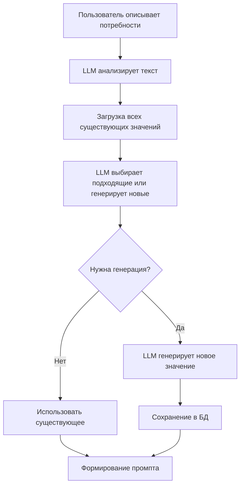

# FEAT-PROMPT-402: Динамическая генерация промптов через LLM

## Статус
Backlog

## Milestone
Post-OSS Release (v2.0)

## Цель
Расширить Prompt Configuration Service возможностью интеллектуальной генерации новых конфигураций промптов на основе описаний пользователей в свободной форме.

## Обоснование
- Невозможно предусмотреть все дисциплины и сценарии заранее
- Пользователи хотят кастомизировать промпты под уникальные задачи
- Community может создавать и делиться конфигурациями
- Автоматическая адаптация под новые области знаний

## Зависимости
- FEAT-PROMPT-401 должен быть завершен и протестирован
- Базовая библиотека placeholder значений должна работать стабильно
- Необходим опыт использования MVP версии от сообщества

## Архитектура расширения

### Новые компоненты

1. **Таблица placeholder_values** - хранение динамически созданных значений
2. **LLM Analyzer** - анализ пользовательских описаний и подбор из существующих
3. **LLM Generator** - генерация новых значений при необходимости

### Алгоритм работы



## План реализации

### Этап 1: Расширение БД (1 день)
- [ ] Добавить таблицу placeholder_values для хранения всех значений
- [ ] Миграция существующих хардкод значений в БД
- [ ] Добавить поле source (system/user_generated) для отслеживания происхождения

### Этап 2: LLM Analyzer (2 дня)
- [ ] Интеграция с OpenAI/Anthropic API для анализа
- [ ] Промпт для извлечения параметров из описания пользователя
- [ ] Загрузка всех существующих значений из БД (30-50 записей)
- [ ] LLM выбор подходящих значений или решение о генерации новых

### Этап 3: Генерация новых значений (2 дня)
- [ ] Промпты для генерации конфигураций новых дисциплин
- [ ] Генерация role_description для новых предметов
- [ ] Создание keywords и requirements
- [ ] Сохранение в БД для будущего использования

### Этап 4: API расширение (1 день)
- [ ] POST /analyze - анализ описания с выбором/генерацией
- [ ] GET /placeholder-values - получение всех значений для LLM
- [ ] POST /placeholder-values - сохранение новых сгенерированных значений

## Технические детали

### Расширенная схема БД
```sql
-- Таблица для всех значений placeholder (системных и сгенерированных)
CREATE TABLE placeholder_values (
    id UUID PRIMARY KEY DEFAULT gen_random_uuid(),
    placeholder_type VARCHAR(100),  -- subject_domain, complexity_level и т.д.
    value_key VARCHAR(100),         -- cryptography, elementary и т.д.
    value_config JSONB,             -- детальная конфигурация значения
    source VARCHAR(20) DEFAULT 'system', -- system или user_generated
    created_by BIGINT,
    usage_count INTEGER DEFAULT 0,
    created_at TIMESTAMP DEFAULT NOW()
);

-- Индексы для быстрого поиска
CREATE INDEX idx_placeholder_type ON placeholder_values(placeholder_type);
CREATE INDEX idx_value_key ON placeholder_values(value_key);
```

### API Endpoints (новые)

#### Анализ описания пользователя
```json
POST /analyze
{
  "user_id": 123456,
  "description": "Хочу изучать квантовую механику на уровне аспирантуры, с акцентом на математический аппарат"
}

Response:
{
  "extracted_params": {
    "subject_domain": "quantum_mechanics",
    "complexity_level": "graduate",
    "focus": "mathematical_rigor"
  },
  "suggestions": [
    {
      "existing": false,
      "needs_generation": true,
      "similar_configs": [...]
    }
  ]
}
```


### Интеграция с LLM

```python
class DynamicPromptGenerator:
    async def analyze_and_select(self, description: str) -> Dict:
        """Анализ описания и выбор из существующих или генерация новых"""
        
        # Загружаем ВСЕ существующие значения (30-50 штук)
        all_values = await self.db.get_all_placeholder_values()
        
        prompt = f"""
        Пользователь описал свои потребности: {description}
        
        Вот все доступные значения для конфигурации:
        {json.dumps(all_values, ensure_ascii=False)}
        
        Задачи:
        1. Извлеки требования из описания пользователя
        2. Для каждого типа placeholder выбери подходящее значение из существующих
        3. Если подходящего значения нет, укажи что нужно сгенерировать новое
        
        Верни в формате:
        {{
            "subject_domain": {{"existing": "physics"}} или {{"generate": true, "description": "..."}},
            "complexity_level": {{"existing": "undergraduate"}},
            ...
        }}
        """
        
        response = await self.llm.ainvoke(prompt)
        return self.process_selection(response)
    
    async def generate_new_value(self, 
                                 placeholder_type: str,
                                 description: str) -> Dict:
        """Генерация нового значения когда нет подходящего"""
        prompt = f"""
        Создай новое значение для {placeholder_type}
        Описание: {description}
        
        Формат ответа:
        {{
            "value_key": "уникальный_ключ",
            "role_description": "...",
            "keywords": "...",
            "requirements": "..."
        }}
        """
        
        response = await self.llm.ainvoke(prompt)
        return await self.save_to_db(response)
```

## Definition of Done

- [ ] Таблица placeholder_values создана и заполнена начальными значениями
- [ ] LLM анализ корректно выбирает из существующих значений
- [ ] Генерация новых значений работает для неизвестных дисциплин
- [ ] Новые значения сохраняются и переиспользуются
- [ ] API endpoints протестированы
- [ ] Документация по использованию динамической генерации

## Метрики успеха

- Процент успешного распознавания запросов (> 90%)
- Количество динамически созданных конфигураций
- Переиспользование сгенерированных значений
- Время на анализ и генерацию (< 5 сек)

## Риски

- Качество LLM-генерации может быть непредсказуемым
- Затраты на API вызовы к LLM провайдерам
- Возможные галлюцинации LLM при генерации
- Накопление низкокачественных сгенерированных значений

## Примеры использования

### Telegram Bot
```
User: Хочу готовиться к олимпиаде по астрономии
Bot: Анализирую ваш запрос...

Найдено похожее:
- Физика (уровень: олимпиадный) - подходит частично

Создать новую конфигурацию "Астрономия (олимпиадный уровень)"?
[Да] [Использовать физику] [Настроить вручную]
```